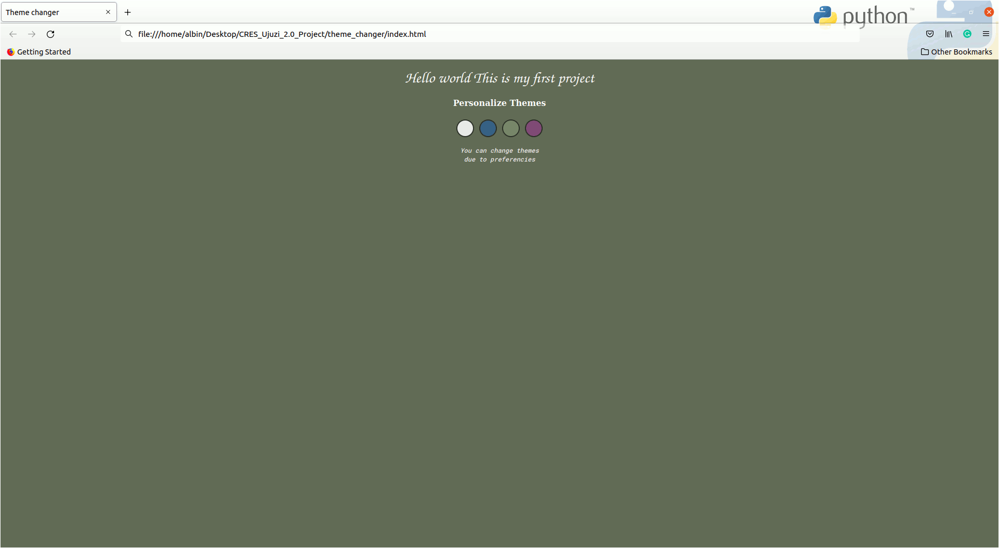

## About the Project

This project is a javascript project for changing background themes when clicking on the button.

## Specification and Technologies

**Specs**

The spec of this project is that the theme is served when the page is reloaded.

**Technologies**

Technologies used for this project are:

- Html
- css (css variables)
- Javascript (functions loops and DOM manupilation)

## Project animated screenshort

