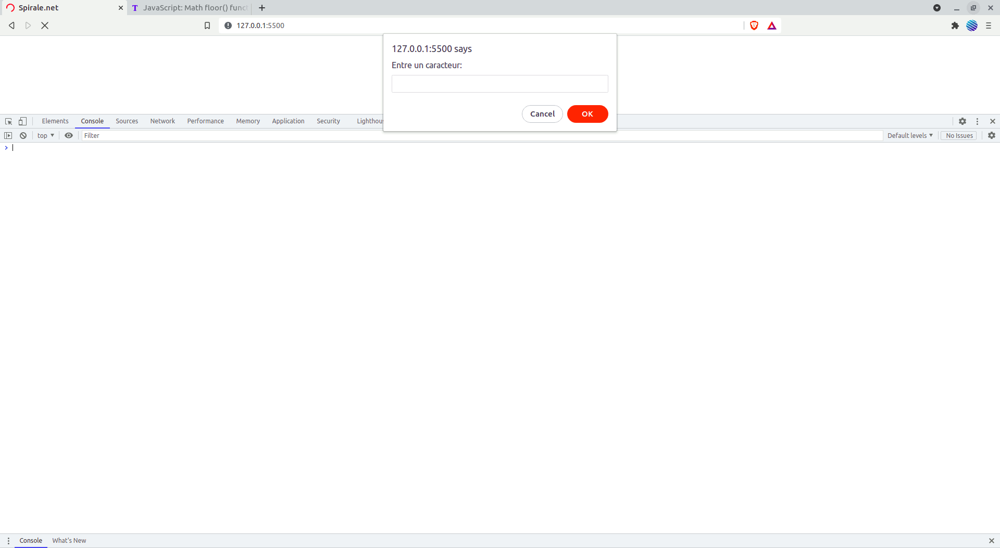

## A propos

Spirale de caracteur c'est un project javascript qui demande a l'utilisateur d'entrer un caracteur et qui luis renvoye le code ASCII du caracteur et en suite Afficher un spirale du caracteur entrer.

## TO DO:
 - **Demande a l'utilisateur d'entre un caracteur**

 - **Convertie le caracteur en Ascii code et l'afficher**

 - **Afficher un spirale du caracteur entrer.**

 ## Resultat: 
 
